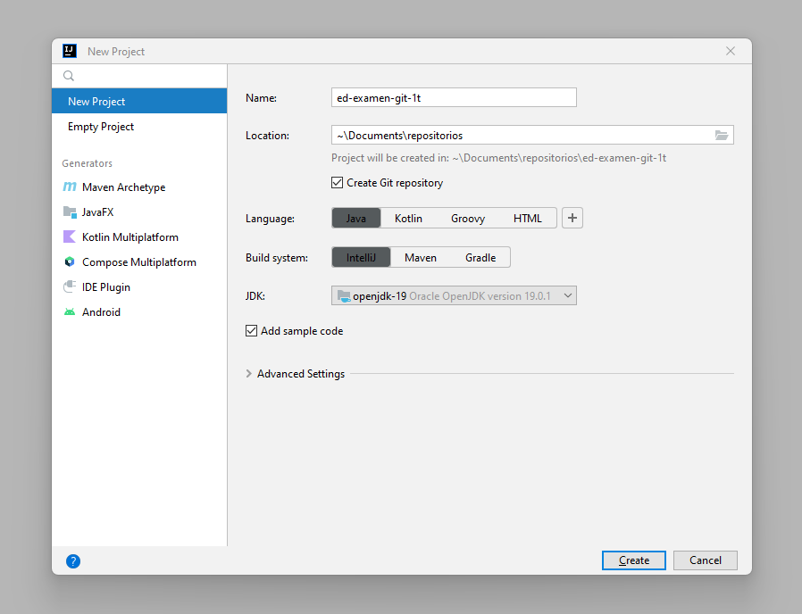
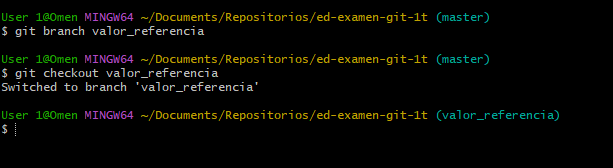
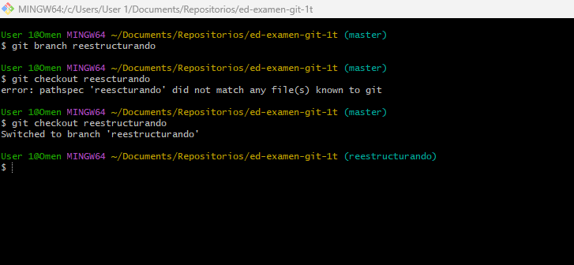

José Antonio Quintero Maya

Grupo: DAM

** 1. Creación de un proyecto de IntelliJ con repositorio Git y código de ejemplo. **

	

** 2. Primer commit en master. **

- Creo el proyecto y hago el primer comit.

	

/// Aquí el código: --->

	```bash
	git status
	git add .
	git commit -m "proyecto base"
    ```

** 3. Creamos y desarrollamos la rama valor_referencia. **

- Creo la rama valor_referencia y me cambio a esa rama:

	

/// Aquí el código: --->

	```bash
	git branch valor_referencia o git checkout -b valor_referencia
	git checkout valor_referencia
    ```
	
- Creo la clase Clase.java, modifico la clase Main.java y lo comiteo:	
	 
	   

/// Aquí el código: --->
	   
	 ```bash
	 git status
	 git add .
	 git commit -m "probando paso por valor y referencia"
     ```
	 
- Hago cambios en la clase Clase.java y también en Main.java y lo comiteo 
	 
	
	 
/// Aquí el código: --->
	 
	  ```bash
	 git status
	 git add .
	 git commit -m "corregido y mejorado"
     ```

** 4. Hacemos un push de la rama valor_referencia. **

- Este paso me lo salto porque voy a subir todas las ramas y su contenido a la vez.

** 5. Hacemos un merge de esta rama a master. **

- Me cambio a la Rama Master y despúes mergeo con la Rama Valor_referencia:
		
	
	
/// Aquí el código: --->
	
	 ```bash
	 git checkout master
	 git merge valor_referencia
     ```

** 6. Creamos una rama paso_arrays y la desarrollamos. **

- Creo la Rama Paso_arrays y me cambio a esa Rama: 

	
	
/// Aquí el código: --->
	
	```bash
	 git checkout master
	 git merge valor_referencia
     ```
	
- Modifico el Main.java y hago comit de ello:

	
	
/// Aquí el código: --->
	
	```bash
	 git status
	 git add .
	 git commit -m "paso_arrays"
     ```
		
** 7. Hacemos un merge a master. **

- Me cambio a la Rama Master y mergeo con paso_arrays:

	
	
/// Aquí el código: --->	
	
	```bash
	 git checkout master
	 git merge paso_arrays
     ```

** 8. Creamos las ramas comparando_objetos y comparando_strings y las desarrollamos. **

- Creo las dos ramas Comparando_objetos y Comparando_strings:
	
	
	
/// Aquí el código: --->	
	
	```bash
	 git branch comparando_objetos o git checkout -b comparando_objetos
	 git branch comparando_strings o git checkout -b comparando_strings
     ```
	 	 
- Me cambio a la Rama Comparando_strings:

	
	
/// Aquí el código: --->	
	
	```bash
	 git checkout comparando_strings
     ```
	
- Creo la Clase CompareWithEquals.java:

	

/// Aquí el código: --->
	
	```bash
	 git status
	 git add .
	 git commit -m "probando equals con strings"
     ```
	
- Me cambio a la Rama Comparando_objetos

	
		
/// Aquí el código: --->	
		
	```bash
	 git checkout comparando_objetos
     ```

- Realizo cambios en el CompareWithEquals.Java, creo la Clase Persona.java y lo comiteamos:

	
	
/// Aquí el código: --->
	
	```bash
	 git status
	 git add .
	 git commit -m "ejemplos de uso de equals con objetos"
     ```

** 9. Hacemos merge de ambas a master, solventando el conflicto. **

- Me cambio a la Rama Master y mergeo con la Rama Comparando_strings:

	
	
/// Aquí el código: --->
	
	```bash
	 git checkout master
	 git merge comparando_strings
     ```
	 
- Ahora hago Merge con Comparando_objetos y tenemos un conflicto, ya que Comparando_strings y Comparando_objetos tienen el mismo archivo: y diferente contendio

	

/// Aquí el código: --->
	
	```bash
	 git merge comparando_objetos
     ```
	 
- Lo soluciono cambiando el contenido y lo comiteo:

	 
	 
/// Aquí el código: --->
	 
	 ```bash
	 git status
	 git add .
	 git commit -m "merge de comparando_strings solventando conflicto"
     ```
	 
** 10. Creamos la rama "reestructurando" para reorganizar en paquetes. Una vez desarrollada hacemos merge a master
(es recomendable ver el estado de los ficheros de este commit, más que el diff). **

- Creo la Rama Reestructurando y me cambio a ella:

	
	
/// Aquí el código: --->
	
	```bash
	 git branch reestructurando o git checkout -b reestructurando
	 git checkout reestructurando
     ```

- Creo los paquetes y realizo las modificaciones en las clases .java necesarias y meto las clases ya creadas anteriormente en sus paquetes correspodientes.

La Clase Main.Java ahora pasa a llamarse PasoObjetos:

- Una vez hechos todos los cambiamos lo comiteo:
	
	
	
/// Aquí el código: --->
	
	```bash
	 git status
	 git add .
	 git commit -m "ordenando en paquetes"
     ```

- Me cambio a la Rama Master y lo mergeo con Reestructurando:

	
	
/// Aquí el código: --->
	
	```bash
	 git checkout master
	 git merge reestructurando
     ```
	
** 11. Realizamos una corrección menor en valor_referencia y la hacemos un merge a master. **

- Me cambio a la Rama Valor_referencia (me pide que realice un commit):


- Modifico el la Clase Clase.java y lo comiteo:


/// Aquí el código: --->
	
		```bash
	 git checkout valor_referencia
	 git status
	 git add .
	 git commit -m "corrección menor: escape de comilla"
     ```
	 
- En este punto me dió un error un poco extraño:

	 

- Me cambio a la Rama Master y mergeo con Valor_referencia:
		

		
/// Aquí el código: --->
	
	```bash
	 git checkout master
	 git merge valor_referencia
	 git status
	 git add .
	 git commit -m "Merge branch 'valor_referencia'"
     ```
	  
- Ahora tan sólo queda subir la rama Master y todo su contenido:

	
	
/// Aquí el código: --->
	
	```bash
	 git remote add origin https://github.com/Joseaquinterom/ed-examen-git-1t.git
	 git push -u origin master
     ```

- Por último subo todas las ramas a la vez y su contenido

	

/// Aquí el código: --->

	 ```bash
	 git push --all
     ```